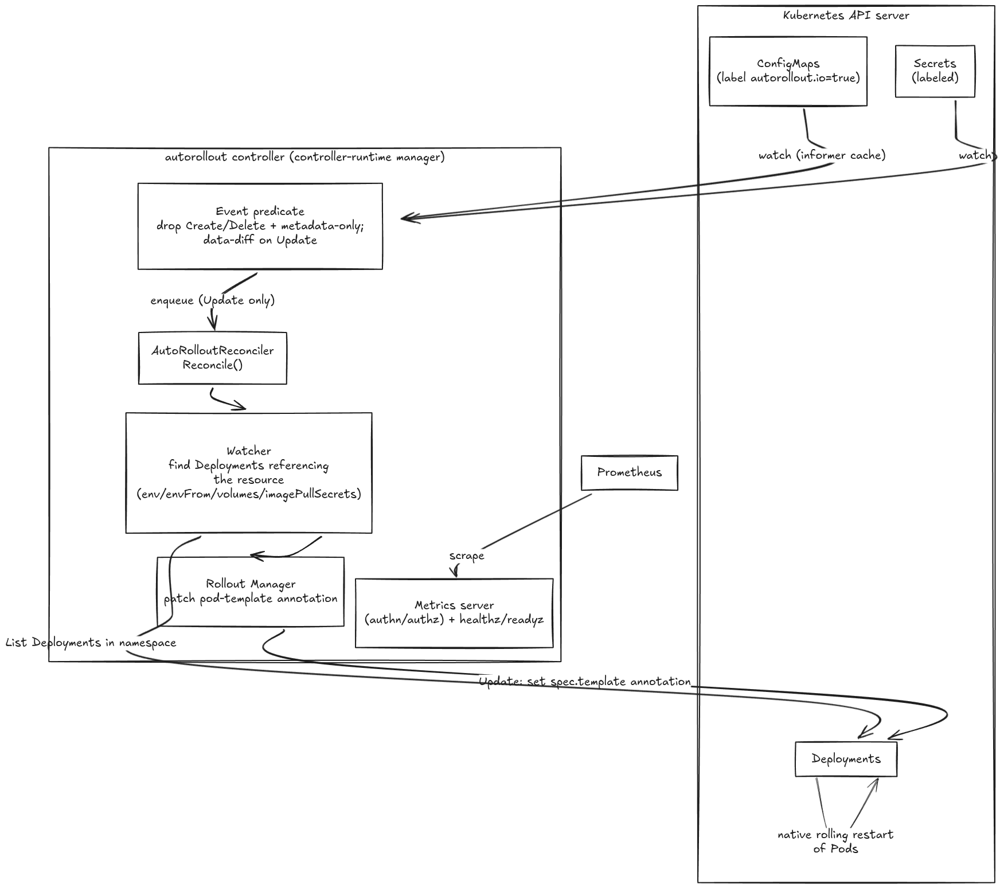

# autorollout

A Kubernetes controller that automatically triggers rollouts of Deployments when their ConfigMaps or Secrets change.

## Overview

### Architecture

#### Summary

- A **Kubernetes operator** (Kubebuilder v4 / controller-runtime) that auto-restarts Deployments when a ConfigMap/Secret they consume changes. **CRD-free**: it introduces no custom resources, opt-in is a label (`autorollout.io=true`) and the dependency graph is derived live from Deployment pod specs.
- The manager watches **ConfigMaps** (`For`) and **Secrets** (`Watches`) via the shared informer cache. An **event predicate** rejects Create/Delete and metadata-only updates, so the reconciler fires only on real data changes to labeled resources.
- On reconcile, the **Watcher** lists Deployments in the changed resource's namespace and inspects pod specs across all reference styles (env `valueFrom`, `envFrom`, volume mounts, image-pull secrets) to find affected Deployments; the **rollout Manager** then patches each Deployment's pod-template annotation (`autorolloutTimestamp`), delegating the actual restart to Kubernetes' native rolling update.
- Runs as a single in-cluster Deployment with optional leader election, health/ready probes, and an authn/authz-protected metrics server; everything goes through the **Kubernetes API server** (no external datastore).



### Features

- **Automatic Rollouts**: Automatically restart deployments when ConfigMaps or Secrets are updated
- **Label-based**: Simple opt-in using labels - no annotations needed on deployments
- **Efficient**: Only watches resources with autorollout labels
- **Safe**: Uses Kubernetes' built-in rolling update mechanism

### How it Works

1. Add `autorollout.io: "true"` label to your ConfigMap or Secret
2. Add `autorollout.io: "true"` label to your Deployment
3. autorollout watches for changes to labeled resources
4. When a change is detected, it finds all labeled Deployments using that resource
5. Triggers a rolling update by updating the deployment's restart annotation

### Resource Detection

autorollout automatically detects when Deployments use ConfigMaps or Secrets through:

- **Environment Variables**: `envFrom.configMapRef`, `env.valueFrom.configMapKeyRef`
- **Volume Mounts**: `volumes.configMap`, `volumes.secret`
- **Image Pull Secrets**: `imagePullSecrets`

## Getting Started

```bash
# Clone the repository
git clone https://github.com/arbhalerao/autorollout.git
cd autorollout
```

### Installation

```bash
kubectl apply -f https://raw.githubusercontent.com/arbhalerao/autorollout/v1.0.0/autorollout-v1.0.0.yaml
```

### Quick Start

#### Deploy Examples

```bash
# Deploy all example manifests (7 deployments showing different patterns)
kubectl apply -f manifests/

# Verify everything is running
kubectl get pods,configmaps,secrets
```

#### Test Automatic Rollouts

```bash
# Update ConfigMap - will restart 3 deployments
kubectl patch configmap app-config -p '{"data":{"log.level":"debug"}}'

# Update Secret - will restart 4 deployments
kubectl patch secret app-secret -p '{"data":{"username":"bmV3LXVzZXI="}}'

# Watch pods restart automatically
kubectl get pods -w
```

## Configuration

The controller runs with minimal configuration. All behavior is controlled through labels on your ConfigMaps and Secrets.

## Development

### Running Locally

```bash
# Install dependencies
go mod download

# Run against your current kubectl context
make run
```

### Development Cluster

```bash
# Create a kind cluster for testing
make create-cluster

# Deploy to the cluster
make deploy IMG=autorollout:dev

# Clean up
make delete-cluster
```

## Troubleshooting

### Common Issues

**Deployment not rolling out?**
- Ensure the ConfigMap/Secret has `autorollout.io: "true"` label
- Ensure the Deployment has `autorollout.io: "true"` label
- Verify the Deployment actually uses the ConfigMap/Secret
- Check controller logs for any errors

**Multiple rollouts happening?**
- This is expected behavior when a ConfigMap/Secret is used by multiple labeled Deployments
- All affected labeled Deployments will roll out simultaneously
